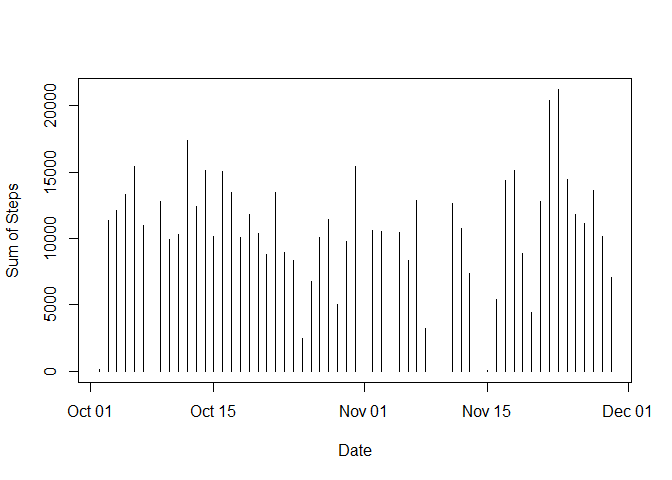
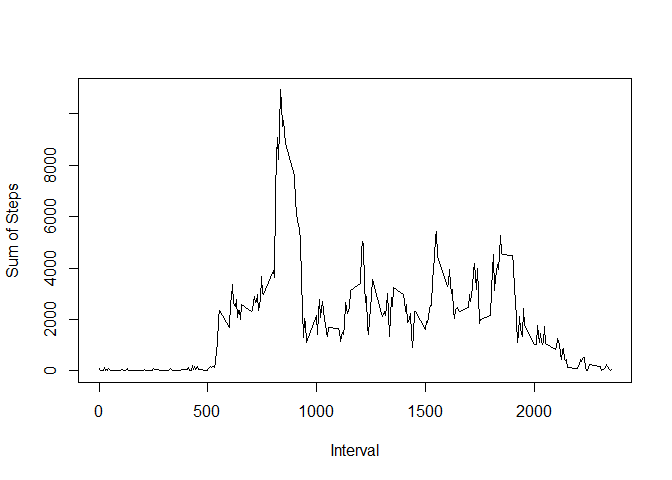
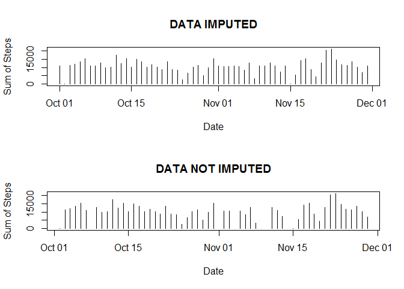
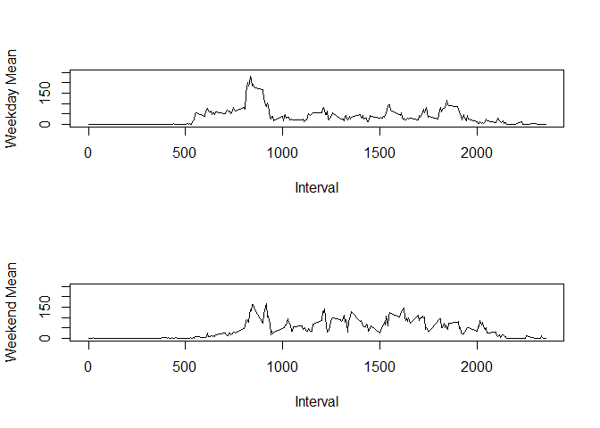

# PA1_Template
Jason Crain  
January 21, 2016  

# Loading and preprocessing

Load up the activity data from the git repo. Take a look at the contents to
figure out what we need to do.


```r
DataSet <- read.csv("activity.csv")
head(DataSet)
```

```
##   steps       date interval
## 1    NA 2012-10-01        0
## 2    NA 2012-10-01        5
## 3    NA 2012-10-01       10
## 4    NA 2012-10-01       15
## 5    NA 2012-10-01       20
## 6    NA 2012-10-01       25
```

Looks like there's a lot of NA data. Take a quick look for non NA data.


```r
head(DataSet[ which (is.na(DataSet$steps) == FALSE), ])
```

```
##     steps       date interval
## 289     0 2012-10-02        0
## 290     0 2012-10-02        5
## 291     0 2012-10-02       10
## 292     0 2012-10-02       15
## 293     0 2012-10-02       20
## 294     0 2012-10-02       25
```

OK.. so lots of zeros, as well.. what else is there?


```r
head(DataSet[ which (DataSet$steps > 5), ])
```

```
##     steps       date interval
## 555   117 2012-10-02     2210
## 556     9 2012-10-02     2215
## 631    36 2012-10-03      430
## 644    25 2012-10-03      535
## 647    90 2012-10-03      550
## 648   411 2012-10-03      555
```

OK. Found good data. I don't think there's any need to preprocess the data.

# Daily mean and activity

To start looking into the daily mean and the activity across different intervals,
take a subset of the data, removing NA values.

```r
NoNASet <- DataSet[ which (is.na(DataSet$steps) == FALSE), ]
```

After that, get the dates and interval values for use later, and make two frames.
One will contain the sum of steps per day, and the other will contain the sum of
steps per interval.

```r
# Get dates and intervals from the set for use later
Dates <- as.Date(unique(NoNASet$date))
Intervals <- unique(NoNASet$interval)

# Setup two frames for use to show by date and by interval
StepsByDayFrame <- data.frame(stringsAsFactors = FALSE, DATE = Dates)
StepsByIntervalFrame <- data.frame(stringsAsFactors = FALSE, INTERVAL = Intervals)
```

Now, we're going to want to use a function so that we can get aggregate data.
After we make the functions, use sapply to apply them to each unique value for
date and interval.

```r
# Function to get steps and lapply to get a list
GetStepsByDate <- function(n) {
    sum(NoNASet[ which (as.Date(NoNASet$date) == n), 1])
}
GetStepsByInterval <- function(i) {
    sum(NoNASet [ which (NoNASet$interval == i), 1])
}

stepsvec <- sapply(StepsByDayFrame$DATE, GetStepsByDate)
intervalvec <- sapply(StepsByIntervalFrame$INTERVAL, GetStepsByInterval)
```

Now, let's finish making the frames and check the data to see how we did.

```r
# check the frames for errors
StepsByDayFrame <- cbind(StepsByDayFrame, datesum = stepsvec, stringsAsFactors = FALSE)
head(StepsByDayFrame)
```

```
##         DATE datesum
## 1 2012-10-02     126
## 2 2012-10-03   11352
## 3 2012-10-04   12116
## 4 2012-10-05   13294
## 5 2012-10-06   15420
## 6 2012-10-07   11015
```

```r
StepsByIntervalFrame <- cbind(StepsByIntervalFrame, intervalsum = intervalvec, 
                              stringsAsFactors = FALSE)
head(StepsByIntervalFrame)
```

```
##   INTERVAL intervalsum
## 1        0          91
## 2        5          18
## 3       10           7
## 4       15           8
## 5       20           4
## 6       25         111
```

Groovy. Now let's take a look at the daily activities.


```r
# Plot the day and steps on a histogram
plot( x = StepsByDayFrame$DATE, y = StepsByDayFrame$datesum, type = "h",
      xlab = "Date", ylab = "Sum of Steps")
```



```r
# print mean and median steps taken daily
MeanSteps <- mean(StepsByDayFrame$datesum)
MedianSteps <- median(StepsByDayFrame$datesum)
print(MeanSteps)
```

```
## [1] 10766.19
```

```r
print(MedianSteps)
```

```
## [1] 10765
```

And let's look at activity across every day, according to interval.


```r
# plot interval activity
plot ( x = StepsByIntervalFrame$INTERVAL, y = StepsByIntervalFrame$intervalsum,
       type = "l",
       xlab = "Interval", ylab = "Sum of Steps")
```



I wonder which interval has the most steps?

```r
# print interval with max steps
StepsByIntervalFrame[StepsByIntervalFrame$intervalsum == max(StepsByIntervalFrame$intervalsum),]
```

```
##     INTERVAL intervalsum
## 104      835       10927
```

# Imputing missing values

In the last part, we removed all the NAs. Now we're going to replace all the NA
values with the average for that particular interval or time

I don't want to work directly on the original data set, so I'll make a new set


```r
# create a new set of data from DataSet and replace NA values
NewSet <- DataSet
```

To start imputing the values, I first need to get a frame built to hold all the
intervals, so I can calculate their mean and impute into the dataset.

After that, I need to calculate the mean for each interval.


```r
# create a dataframe to hold interval mean values
IntervalMeanFrame <- data.frame(stringsAsFactors = FALSE,
                                  INTERVAL = unique(NewSet$interval))

# calculate a mean for each interval
IntervalMean <- function(n) {
    mean(NewSet[ which(NewSet$interval == n),1], na.rm = TRUE)
}
intervalmeansvec <- sapply(IntervalMeanFrame$INTERVAL, IntervalMean)
IntervalMeanFrame <- cbind(IntervalMeanFrame, intervalmeansvec, 
                           stringsAsFactors = FALSE)

# check out work
head(IntervalMeanFrame)
```

```
##   INTERVAL intervalmeansvec
## 1        0        1.7169811
## 2        5        0.3396226
## 3       10        0.1320755
## 4       15        0.1509434
## 5       20        0.0754717
## 6       25        2.0943396
```

I probably could have given the new column a nicer name, but we won't be using it 
that much, so I'm just going to keep going.

Replace all the NA values with the mean value calculated and check my work.


```r
# replace all the NAs with the mean for that interval
for (BlankInterval in unique(NewSet[which(is.na(NewSet$steps) == TRUE),3])) {
    NewSet[which(is.na(NewSet$steps) == TRUE & NewSet$interval == BlankInterval),1] <-
        IntervalMeanFrame[which(IntervalMeanFrame$INTERVAL == BlankInterval),2]
}

head(NewSet)
```

```
##       steps       date interval
## 1 1.7169811 2012-10-01        0
## 2 0.3396226 2012-10-01        5
## 3 0.1320755 2012-10-01       10
## 4 0.1509434 2012-10-01       15
## 5 0.0754717 2012-10-01       20
## 6 2.0943396 2012-10-01       25
```

Now lets look at how things have changed.


```r
# repeat plots and mean/median for comparison
NewStepsByDayFrame <- data.frame(stringsAsFactors = FALSE, DATE = as.Date(unique(NewSet$date)))
GetNewStepsByDate <- function(n) {
    sum(NewSet[ which (as.Date(NewSet$date) == n), 1])
}
newstepsvec <- sapply(NewStepsByDayFrame$DATE, GetNewStepsByDate)
NewStepsByDayFrame <- cbind(NewStepsByDayFrame, newstepsvec, stringsAsFactors = FALSE)

# compare new to old
# Plot the day and steps on a histogram
par(mfrow = c(2,1))
plot( x = NewStepsByDayFrame$DATE, y = NewStepsByDayFrame$newstepsvec, type = "h",
      xlab = "Date", ylab = "Sum of Steps",
      main = "DATA IMPUTED")
plot( x = StepsByDayFrame$DATE, y = StepsByDayFrame$datesum, type = "h",
      xlab = "Date", ylab = "Sum of Steps",
      main = "DATA NOT IMPUTED")
```



```r
# print mean and median steps taken daily
NewMeanSteps <- mean(NewSet$steps)
NewMedianSteps <- median(NewSet$steps)
print(NewMeanSteps)
```

```
## [1] 37.3826
```

```r
print(NewMedianSteps)
```

```
## [1] 0
```

```r
# print old data
MeanSteps <- mean(StepsByDayFrame$datesum)
MedianSteps <- median(StepsByDayFrame$datesum)
print(MeanSteps)
```

```
## [1] 10766.19
```

```r
print(MedianSteps)
```

```
## [1] 10765
```

The value of zero for the new median can be explained by how low some of the interval
mean values are. Some are much, much smaller than 1, but barely larger than 0. This
throws things off a bit. In all, imputing the data did cause some fairly significant
changes to the mean and median. However, the graphs look pretty similar.

# Weekend vs Weekday

Now lets look at steps across all intervals, but see if there's a difference between
weekend and week day.


```r
# check for weekend vs weekday activity in NewData
WeekendVsDay <- function(d) {
    v <- switch(weekdays(d), Saturday = "weekend", Sunday = "weekend", "weekday")
    return(v)
}

# assign weekend or week day to each day in the set
WeekendVsDayVec <- sapply(as.Date(NewSet$date), WeekendVsDay)
NewSet <- cbind(NewSet, weekday=WeekendVsDayVec)

# create a set of data for weekdays and one for weekends
WeekendNewSetData <- NewSet[ which (NewSet$weekday == "weekend"), ]
WeekdayNewSetData <- NewSet[ which (NewSet$weekday == "weekday"), ]
```

We have to get averages for each and put into a frame for plotting. Because we know that many of the mean values are very, very small, we return 0 if the value is < 0.5, to make graphing easier. We also limit means to a whole integer using round(). Although we didn't do this earlier, it makes sense since we can't have fractions of steps.


```r
sbiSet <- data.frame(stringsAsFactors = FALSE, 
                         INTERVAL = as.integer(Intervals))

# get weekend interval means
WeekendIntervalMean <- function(n) {
    val <- mean(WeekendNewSetData[ which(WeekendNewSetData$interval == n),1], na.rm = TRUE)
    if (val < 0.5) { return(0) }
    else { return(round(val, digits = 0)) }
}
weekendVec <- sapply(sbiSet$INTERVAL, WeekendIntervalMean)
sbiSet <- cbind(sbiSet, WeekendMean=weekendVec, 
                           stringsAsFactors = FALSE)

# get weekday interval means
WeekdayIntervalMean <- function(n) {
    val <- mean(WeekdayNewSetData[ which(WeekdayNewSetData$interval == n),1], na.rm = TRUE)
    if (val < 0.5) { return(0) }
    else { return(round(val, digits = 0)) }
}

# combine the two into a single data set
weekdayVec <- sapply(sbiSet$INTERVAL, WeekdayIntervalMean)
sbiSet <- cbind(sbiSet, WeekdayMean=weekdayVec, 
                    stringsAsFactors = FALSE)

par(mfrow = c(2,1))
plot(sbiSet$INTERVAL, sbiSet$WeekdayMean, type="l",
     xlab = "Interval", ylab = "Weekday Mean",
     ylim = c(0,250))
plot(sbiSet$INTERVAL, sbiSet$WeekendMean, type="l",
     xlab = "Interval", ylab = "Weekend Mean",
     ylim = c(0,250))
```


